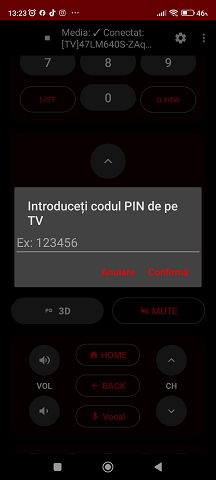
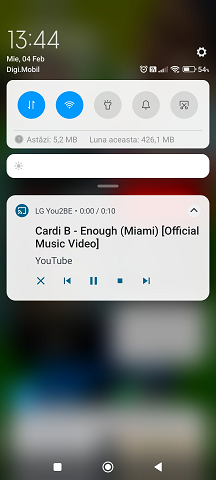
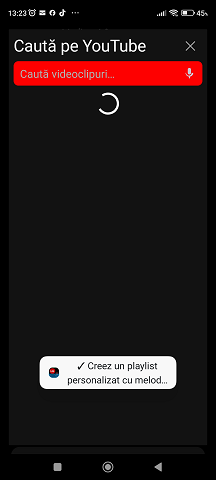
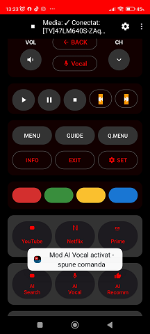

🤖 AI-Powered LG TV Remote (2012 Netcast)

“I built a full AI-powered assistant for a 13-year-old TV using only AI-generated code.”

This project is an Android application that turns a smartphone into a powerful, multifunctional remote control for legacy LG Netcast TVs (2012–2014) and other DLNA-compatible devices.

What makes this project special is how it was built:
👉 This project was built entirely using free-tier AI models (ChatGPT, Claude, DeepSeek, and Gemini),by a developer with zero prior programming experience.  
It demonstrates how different AI models can complement each other when you know what to ask.
> **Note:** This project is not affiliated with, endorsed by, or sponsored by OpenAI, Anthropic,Google, or DeepSeek. All mentioned AI tools were used strictly under their free-tier terms.

It is both a functional product and a real-world experiment showing how modern AI tools can lower the barrier to software development.

🚀 Project Vision

Smart TVs age quickly. Many LG Netcast TVs are still perfectly functional but lack modern features like voice control, smart playlists, or easy media casting.

This project aims to:

Extend the lifespan of legacy LG TVs

Bridge old hardware with modern AI

Demonstrate AI-assisted development in practice, not just theory

🔥 Key Features
🎙️ Romanian Voice Control (AI-Powered)

Control your TV using natural Romanian language

Voice commands are interpreted using Groq AI

Examples:

“Play rock music on YouTube”

“Open YouTube”

“Pause the video”

“Create a playlist with 90s rock”

📺 DLNA Media Streaming

Stream video content directly from your phone to the TV

Supports:
Voice Control (AI & Direct Commands) :
- Control TV volume (volume up / down / mute)
- Change TV channels using voice commands
Works in two modes:
  -  AI-powered: natural language commands interpreted by AI
    - e.g. “increase the volume”, “switch to channel 5”, “lower the sound”
  - Direct voice commands: predefined commands without AI processing
    - e.g. “volume up”, “channel five”

YouTube videos

AI-generated playlists

No screen mirroring — legacy LG Netcast TVs do not support modern mirroring protocols,so media playback is implemented via native DLNA streaming.

🎵 AI-Generated Playlists

Create playlists using simple prompts

AI selects relevant YouTube content automatically

Fully hands-free experience when combined with voice control

🧠 Built Without Programming Knowledge

100% of the source code was generated, refined, and debugged with AI

Focus was placed on:

Asking the right questions

Iterative improvement

Understanding system architecture instead of syntax

Shows how multiple free AI models complement each other when used correctly

🛠️ Tech Stack
Technology	Purpose
Kotlin	Main Android programming language
Kotlin Coroutines	Asynchronous operations (network, UI, streaming)
DLNA / UPnP	Media streaming to TVs
LG Netcast Protocol	Legacy LG TV remote control & pairing
Groq AI API	Voice command interpretation (Romanian language)
NewPipe Extractor	YouTube stream extraction
OkHttp	HTTP networking
ConnectSDK	Device discovery & TV connectivity
📊 Project Stats

🧾 6,000+ lines of Kotlin code

⚙️ 15+ Android services & helpers

🤖 100% AI-generated code

⏱️ Initial working prototype built in just 2 days
    Reached a fully functional, stable state in approximately **2 weeks**
👤 Developed by a non-programmer

🧩 Architecture Overview

The application is built from multiple independent components that work together:

1️⃣ DiscoveryManager

Scans the local network

Detects LG Netcast TVs and DLNA devices

Handles device availability and connection lifecycle

2️⃣ RemoteControlActivity

Main application “brain”

Manages:

UI interactions

Voice input

Command routing

Media playback flow

3️⃣ GroqAIHelper

Sends transcribed voice commands to Groq AI

Receives structured actions (play, pause, search, playlist creation)

Translates natural language into executable logic

4️⃣ YouTubeSearchHelper & NewPipeHelper

Searches YouTube content

Extracts direct video/audio streams

Avoids the need for the official YouTube API

5️⃣ DLNAService & SimpleHttpServer

Runs a local HTTP server on the phone

Serves media files to the TV via DLNA

Ensures compatibility with older Netcast firmware

6️⃣ NetcastPairingHelper

Handles pairing with LG Netcast TVs

Manages authentication and command transmission

Enables classic remote control functionality

⚠️ Disclaimer

This project is intended for educational and experimental purposes

YouTube content handling relies on third-party open-source tools

No official affiliation with LG or Google

🌱 Why This Project Matters

This repository is not just an app — it’s a case study:

How AI can act as a senior developer

How legacy hardware can gain modern features

How curiosity + AI can replace years of traditional learning

📌 Future Ideas

Multi-language voice support

Local AI (offline commands)

Android TV companion mode

Automatic device profiles

📸 Screenshots

